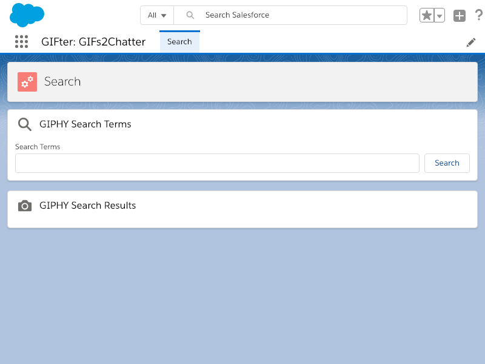

# sfdx-puppeteer

This is a simple project to demonstrate how you can combine Puppeteer (i.e. a headless Chrome Node API) with Salesforce DX, and more specifically scratch orgs and the Salesforce CLI.

## Setup

Install all the Node dependencies. If this is your first time it may take a few minutes.

```
yarn install
```

## Run

Ensure you've logged into your Developer Hub and designated it accordingly. You can confirm by running `sfdx force:config:list` in the project and ensuring the `defaultdevhubusername` is set.

Then run the script:

```
./run.sh
```

After the script finishes running, you should see a file called `org.png` in the root that looks like this:



You can edit the `run.sh` and `run.js` files to try out different settings.

Enjoy!
